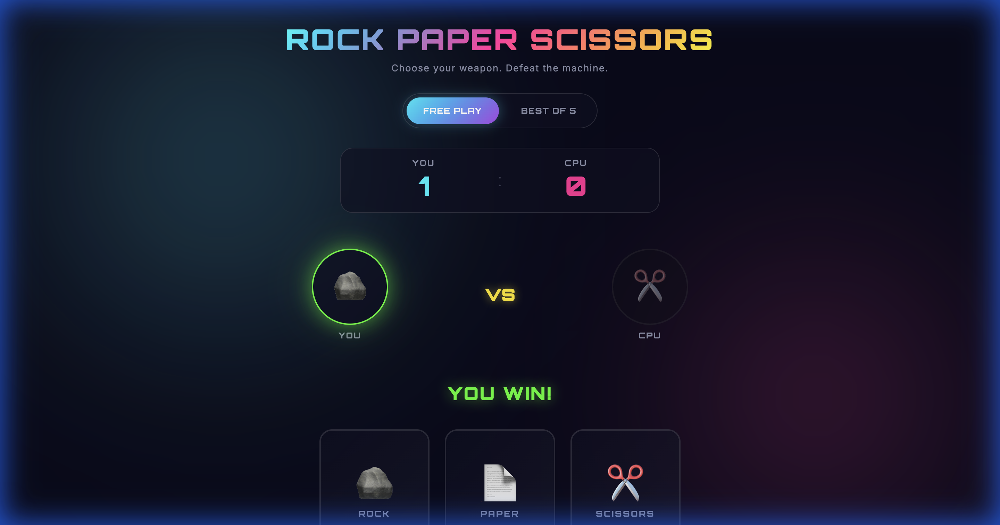

# Rock Paper Scissors — Neon Arena 🪨 📄 ✂️

A visually stunning, modern Rock Paper Scissors game build with Vanilla JavaScript, CSS Grid, and Neon/Glassmorphism design. Play against a machine in an environment with fluid animations and synth sound effects.



## ✨ Features

- **Modern Aesthetics**: Vibrant neon colors, glassmorphism UI, and animated background blobs.
- **Dynamic Gameplay**: Thinking animations for the CPU and real-time result highlights.
- **Game Modes**:
  - **Free Play**: Casual endless matches.
  - **Best of 5**: Competitive series tracking.
- **Responsive Design**: Fully optimized for mobile, tablet, and desktop using fluid scaling (`clamp`).
- **Audio & Visuals**: In-browser synth sound effects and confetti celebrations on victory.

## 🚀 Quick Start

### 🌐 Live Demo
Play the game instantly here: **[https://alfredang.github.io/scissor-paper-stone-game/](https://alfredang.github.io/scissor-paper-stone-game/)**

### Running Locally
Simply open `index.html` in any modern web browser.

### Running with Docker

You can run the game instantly using Docker:

```bash
# Pull the image from Docker Hub
docker pull alfredang/scissor-paper-stone-game:latest

# Run the container
docker run -p 8080:80 alfredang/scissor-paper-stone-game:latest
```
Then visit `http://localhost:8080` in your browser.

## 🛠️ Built With

- **HTML5**: Semantic structure.
- **CSS3**: Custom properties, Flexbox, Grid, and Animations.
- **JavaScript**: Pure Vanilla JS (No frameworks).
- **Web Audio API**: For synthetic sound generation.

## 🐳 Docker Build Instructions

If you want to build the image yourself:

```bash
docker build -t alfredang/scissor-paper-stone-game .
```

---

*Developed with the help of Antigravity — Your AI Coding Assistant.*
